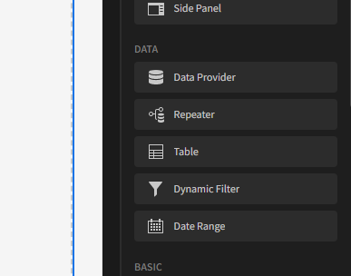
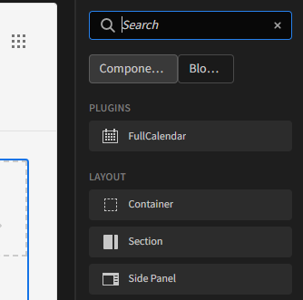
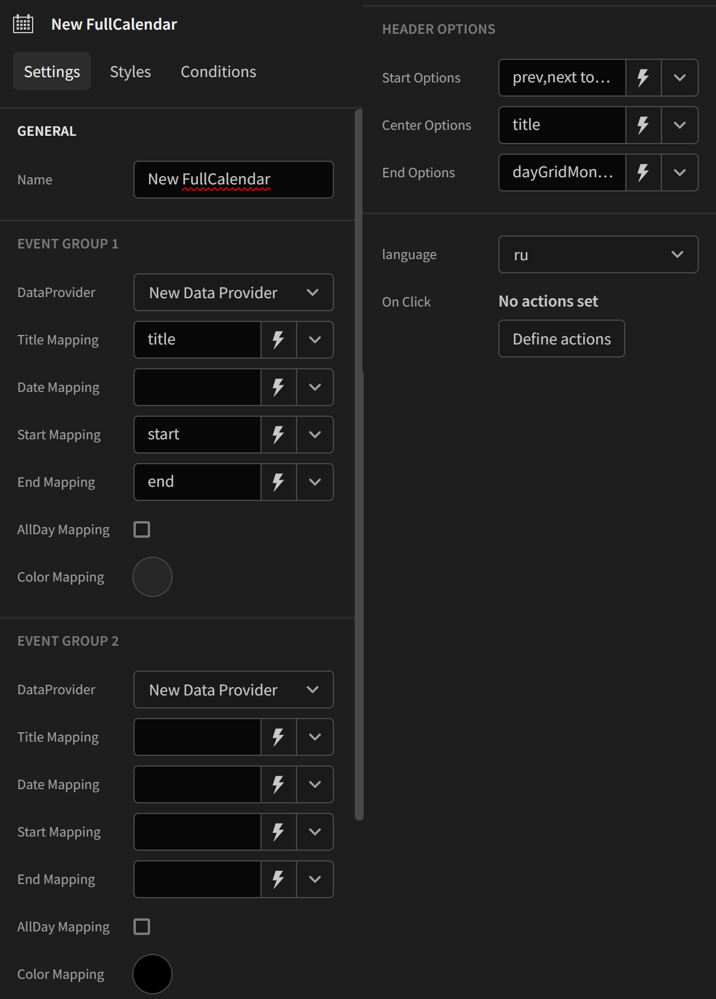

# Calendar

## Description
It's a component to implement fullcalendar in your budibase.

## Installation
To install the plugin for Budibase, follow these steps:

1. Copy the repository link ```https://github.com/timschell/sinavailable-calender.git```.
2. Open Budibase and navigate to the "Plugins" section.
3. Click add plugin.
4. Select GitHub source.
5. Put the link in the URL section


<p>The plugin will be installed automatically.</p>

## Use

After installing the plugin for Budibase, you can start using it in your application. 
The plugin adds full calendar and functionality to the platform, allowing you to further customize your application.
You can use up to two data sources, the first source is mandatory. You can differentiate the two data sources in the calendar by changing the colors.

1. First add a data source <p></p>
2. Add the calendar component inside the data source, you can search for FullCalendar <p></p>
3.  Configure the data that will be used, the fields <b>Title Mapping (Event Group 1) </b> and <b>Date Mapping (Event Group 1)</b> are mandatory <p></p>

## Features

1. Add events
2. Map data that appears in the calendar
3. Group data by color
4. Change language


## Instructions
To build this plugin run the following in your Budibase CLI:

```budi plugins --build```
You can also re-build everytime you make a change to your plugin with the command:

``` budi plugins --watch ```
